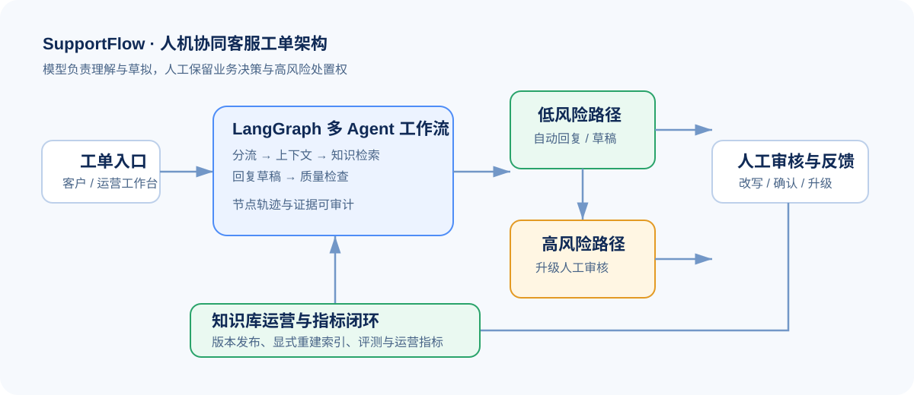

# SupportFlow｜企业客服工单多 Agent 协同运营平台

> 让 AI 参与客服处理，但不越过人工、权限与证据边界。


SupportFlow 是面向企业客服运营的多 Agent + RAG 平台。它不把大模型当成“自动客服替身”，而是围绕一张工单设计**分流、上下文读取、知识检索、回复草稿、质量检查、人工审核与知识回流**的可审计工作流。

<p align="center">
  
</p>

| 多 Agent 协作 | 证据约束 RAG | 人工审核闭环 | Docker 部署 |
| :---: | :---: | :---: | :---: |
| 职责节点与运行轨迹 | 来源与版本可追溯 | 高风险升级、改写反馈 | 本地开箱即用 |

## 01. 问题定义

客服场景真正难的不是“生成一段回复”，而是决定：什么问题可以自动处理、什么问题必须人工接管、系统依据什么知识作答，以及人工修改后如何改进下一次处理。

```text
客户工单
   │
   ▼
分流 Agent ── 高风险 / 低置信度 ──► 升级人工
   │
   ▼
只读客户与订单上下文 → 知识检索 → 回复草稿 → 质量检查
                                                   │
                                        自动回复 / 审核草稿
                                                   │
                                         人工反馈 → 知识运营
```

## 02. 产品设计与功能实现

| 模块 | 实现与价值 |
| --- | --- |
| 多 Agent 工作流 | 基于 LangGraph 拆分分流、客户上下文、订单上下文、知识检索、回复生成、质检等职责节点；每个节点保留处理轨迹，便于定位失败环节。 |
| 人机协同分流 | 结合工单类型、风险等级与知识命中情况，输出“自动回复 / AI 草稿待审核 / 升级人工”，不让模型处理高风险动作。 |
| 证据约束 RAG | 回复关联知识来源与版本；检索不可用或证据不足时进行安全降级，而不是编造答案。 |
| 知识库运营 | 支持知识文档发布、版本管理与显式重建索引，让政策与 FAQ 可控进入检索链路。 |
| 审核与指标闭环 | 支持人工改写、审核反馈、风险升级；沉淀证据覆盖率、升级率、人工改写率、负向反馈率和 P95 延迟等运营指标。 |
| 权限与审计 | JWT / RBAC 约束知识发布、审核与指标查看；模型只读取业务上下文，不具备退款、改订单或改客户资料的写权限。 |

## 03. 多 Agent 工作流设计

| 节点 | 输入 | 处理 | 输出 |
| --- | --- | --- | --- |
| Triage Agent | 工单主题、正文、历史状态 | 识别工单类型、风险级别与优先级 | 路由策略：自动回复 / 审核草稿 / 升级人工 |
| Context Agent | 工单关联信息 | 通过只读工具读取客户、订单与历史上下文 | 结构化业务上下文 |
| Knowledge Agent | 工单问题、业务范围 | 检索知识库并记录来源与版本 | 可引用证据或“证据不足”信号 |
| Reply Agent | 上下文、知识证据 | 生成回复草稿，不执行业务写操作 | 带证据的草稿 |
| Quality Agent | 草稿、风险、检索证据 | 校验风险、证据覆盖与回复质量 | 通过 / 待审核 / 升级人工 |
| Human Review | 草稿、质检与证据 | 人工改写、确认、拒绝或升级 | 审核反馈与审计记录 |

## 04. 技术架构

```text
Web 工作台 / 客户入口
          │
          ▼
      FastAPI API
          │
          ├── LangGraph 工作流
          │      ├── 路由与风险判断
          │      ├── 只读业务工具
          │      ├── RAG 检索与回复生成
          │      └── 质量检查与人工升级
          │
          ├── SQLite（本地）/ PostgreSQL（可切换）
          └── Redis + Celery（可选异步拓扑）
```

## 05. 已实现功能清单

- [x] 工单创建、分类、风险识别与人工升级
- [x] LangGraph 多节点工作流与节点运行轨迹
- [x] 知识文档发布、版本管理与显式重建索引
- [x] RAG 检索、来源引用与证据不足安全降级
- [x] 自动回复、AI 草稿待审核、升级人工三类处理策略
- [x] 人工改写、审核反馈、风险升级与审计记录
- [x] JWT 登录、RBAC 角色权限与演示角色切换
- [x] 运营指标：证据覆盖率、升级率、人工改写率、负向反馈率、P95 延迟
- [x] 离线评测、公开客服工单验证与知识更新实验展示
- [x] SQLite 本地运行、PostgreSQL 配置切换、Redis / Celery 异步拓扑、Docker Compose

## 06. 快速开始

### 本地运行

```powershell
python -m unittest discover -s supportflow\tests -v
python -m uvicorn supportflow.api:app --host 127.0.0.1 --port 8765
```

打开：

- 运营工作台：<http://127.0.0.1:8765/workbench>
- 客户入口：<http://127.0.0.1:8765/customer>
- API 文档：<http://127.0.0.1:8765/docs>

完整架构、评测与部署说明见 [supportflow/README.md](supportflow/README.md)。

## 07. 推荐演示路径

1. 创建一张退款、订单异常或产品问题工单。
2. 查看工作流如何完成分类、检索、草稿生成与质检。
3. 对高风险工单执行人工升级或人工改写，观察审核反馈。
4. 发布一篇知识文档并重建索引，验证知识运营闭环。
5. 在工作台查看证据覆盖率、人工改写率与延迟等指标。

## 08. 数据与安全边界

- 仓库不包含 API Key、数据库连接串、CRM / 客服渠道凭据或真实客户数据。
- 公开评测只使用脱敏样例与公开数据处理后的汇总结果。
- 模型不具备业务系统写操作权限；涉及退款、改订单、账户安全等动作必须人工处理。
- Vercel 演示使用同步 `inline` 执行与临时 SQLite 文件系统，仅用于体验产品交互和 AI 工作流，**不是生产环境**。

## 09. 后续生产化演进

- 接入真实 CRM、邮件、企微或电商客服渠道；保持工具只读与人工确认边界。
- 将本地状态迁移到 PostgreSQL / 对象存储，并接入日志、监控与告警。
- 使用 Redis / Celery 或消息队列承接异步任务。
- 用真实脱敏工单建立人工标注、A/B 实验与持续评测流程。

## 10. 项目结构

```text
supportflow/       核心领域逻辑、工作流、检索、指标与测试
supportflow/docs/  架构、评测与公开数据实验说明
app.py             部署入口
docker-compose.yml 本地服务编排
```

如发现安全问题，请按 [SECURITY.md](SECURITY.md) 私下报告。
