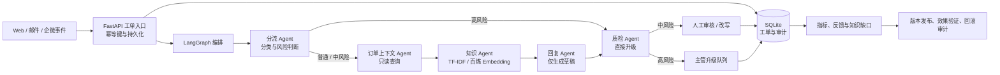

# SupportFlow 演示与面试手册

## 一句话定位

SupportFlow 是面向企业客服工单的风险受控多 Agent RAG 工作台：AI 只输出带证据的回复草稿；退款、隐私和投诉等高风险问题必须由人工处理。

## 真实架构

## 3 分钟演示脚本

### 0:00–0:20：说明问题和边界

打开 `http://127.0.0.1:8765/workbench`，以“客服主管”登录或选择演示角色。

说：

> 这个项目不是让模型直接处理客户权益，而是把客服处理拆成可审计的状态流。模型只生成有依据的草稿，真正的退款、账户与赔付决策保留给人工。

### 0:20–1:10：演示中风险工单与人工审核

创建工单：`购买后可以提现吗？订单号 ORD-1001。`

展示：

- 分流结果为退款类、中风险；
- 订单上下文 Agent 仅追加只读订单证据；
- 知识 Agent 给出带来源编号的政策证据；
- 回复 Agent 只生成草稿；
- 质检后进入人工审核，而不是自动发送。

编辑一小段草稿后批准，指出审批记录保存了操作者、角色和编辑内容。

说：

> 多 Agent 的价值不在于多个 Prompt 对话，而在于每个节点有明确输入输出和权限边界。订单工具没有退款、取消或改账户的方法，模型无法越权调用。

### 1:10–1:40：演示高风险拦截

创建工单：`我要投诉隐私泄露，并要求立即赔偿。`

展示其被直接升级：不检索、不生成草稿。

说：

> 高风险路由是确定性规则，直接绕过生成。这能避免模型用看似礼貌的回复作出赔偿承诺。

### 1:40–2:25：演示反馈驱动的知识运营

对已审核工单填写“需要改写”反馈；切换管理员发布同分类知识。

展示“待补充知识”和“知识优化效果”：

- 发布后只是进入验证期，并不会自动关闭缺口；
- 前后各至少 3 条反馈才能比较；
- 发布后工单引用新知识不足 50% 时显示“归因不足”，先检查检索，而不是宣称知识有效；
- 支持恢复历史版本，恢复会生成新版本而非覆盖，并在操作审计中留下记录。

### 2:25–3:00：工程保障与取舍

展示质量看板、Run metadata 和 `supportflow/docs/EVALUATION_GUIDE.md`。

说：

> 每次运行记录 Agent 延迟、检索模式、模型与 Prompt 版本；32 个自动化测试覆盖权限、幂等、恢复、知识版本和归因逻辑。30 条确定性评测覆盖路由、状态、证据与安全门槛。当前小型关键词语料默认使用本地 TF-IDF；百炼语义检索保留为可配置适配层，而不是为了使用 Embedding 强行默认开启。

## 项目亮点（简历可用）

- 基于 LangGraph 构建企业客服多 Agent 工作流，拆分分流、只读订单上下文、RAG 检索、草稿生成与质检节点；高风险工单确定性跳过生成并升级人工。
- 设计可追溯 RAG：回复绑定来源、版本和检索模式；支持本地 TF-IDF 与百炼 Embedding 适配，外部依赖异常自动降级至安全本地方案。
- 实现 JWT/RBAC、人工审核与改写、幂等提交、异步任务恢复及 SQLite 审计，保证客服决策和模型运行信息可回溯。
- 搭建反馈驱动的知识运营闭环：负向反馈归因知识缺口，发布后通过样本门槛与来源引用覆盖率评估效果，并支持版本化回滚与操作者审计。

## 高频追问

### 为什么不用一个大 Prompt？

因为分类、检索、生成、质检和业务工具的权限不同。拆成状态节点后，高风险路径能绕开生成，质检能独立检查证据与承诺边界，且每一步都能单独观测和测试。

### 为什么不让 AI 自动退款？

退款、赔付和账户操作会直接影响用户权益。当前模型只是建议生成器；订单能力是只读工具，实际业务动作必须经过人工或后续受控的交易系统。

### 如何防止 RAG 幻觉？

生成阶段只接收检索证据；证据为空或回复出现越权承诺时，质检会阻断草稿并升级。证据来源和版本会随工单持久化，便于人工复核。

### 如何证明知识更新真的有效？

不能只看发布后总指标。系统按发布时间建立前后同类工单 cohort，并要求两侧均有最少 3 条反馈；同时要求发布后至少 50% 工单真正引用该来源，否则标记“归因不足”。

### 当前边界是什么？

本地演示使用 SQLite 与 Python 后台线程；Docker 已支持一键启动和数据持久化。生产环境下一步会替换为 PostgreSQL、Redis/Celery、真实订单/CRM 适配器以及集中式日志告警。
